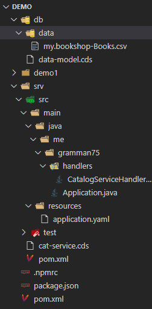
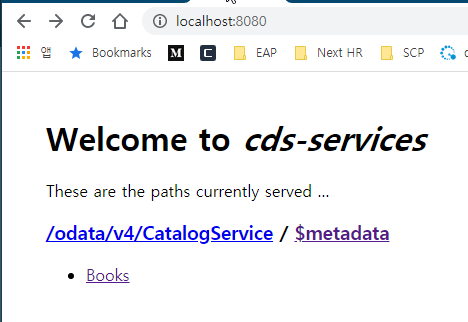

# Local개발환경구성

## 설치파일

* Node.js설치
* SQLite설치
* @sap/cds-dk 설치

```
npm i -g @sap/cds-dk
cds # test id
```
* Java 8설치
* Apache Maven설치

## 설치확인

```
cds --version
java -version
mvn --version
```

## 신규 프로젝트 생성
스프링 boot기반의 프로젝트 생성

### Quick Start

#### 초기 프로젝트 생성

```
cds init demo --add java --java:package me.gramman75
```

위와 같이 Commond line에서 수행을 하면 아래와 같이 폴더 구조가 생성이 됨.



* db : CDS모델이 위치하는 폴더(data-model.cds)
* srv : CDS의 서비스 정의와 java코드가 위치하는 폴더.(cat-service.cds)
* srv/src/main/java : java application logic
* srv/src/gen/java : CDS기반으로 compile된 java파일이 생성이됨(빌드하면 생성됨). queryDsl의 Q파일과 유사함.
* node and node_modules : cds 컴파일 기능을 사용하기 위한 node파일. global로 생성을 했으면 해당 폴더 없음.


#### 테스트 모듈 추가

java의 테스트 모듈을 추가하기 위해서 아래 명령어 수행하면 일반적인 spring기반의 test 폴더가 생성됨.

```
mvn com.sap.cds:cds-maven-plugin:addIntegrationTest
```

#### Build and Run

아래와 같이 수행을 하면 Build시에 cdsdk를 위해서 node.js런타임과 과련 라이브러리를 해당 프로젝트에 다운을 받아서 실행이 됨.
```
mvn spring-boot:run
```

위와 같이 하면 빌드를 독립적으로 할 수는 있지만 시간이 많이 걸리기 때문에 _cds-dk_ 를 global하게 설치하고 path에 node.js실행파일경로를 추가한 후에 아래와 같이 수행하면 시간을 단축시킬 수 있음.

```
mvn spring-boot:run -P cdsdk-global
```

수행을 하면 spring-boot의 내장 tomcat이 수행이 되면서 http://localhost:8080/ 에 접근을 하면 Book에 대한 OData가 자동 생성이 되어 있음.



#### _cds watch_ 실행

.cds, .json.js파일이 변경될 때 마다 서버가 자동실행되어 반영이 되도록 하기 위해서 cds watch 를 수행.(nodejs의 watch)

```
cds watch demo
```

#### 도메인 모델 정의하기

```sql
using { managed } from '@sap/cds/common';
namespace db.cm.code;

entity CODE_GROUP : managed {
    key grp_cd : String(30);
    grp_nm : String(100);
    sys_cd : String(30);
    code: Association to many CODE on code.grp_cd = $self;
}

entity CODE : managed {
    key grp_cd: Association to CODE_GROUP { grp_cd };
    key cd : String(30);
    cd_desc : String(300);
    code_m : Association to many CODE_M  { grp_cd, cd};
} 

entity CODE_M : managed {
    key grp_cd: Association to CODE { grp_cd };
    key cd: Association to CODE { cd };
    key lang : String(30);
    cd_nm : String(300);
}
```

해당 엔티티 정의가 오류가 없는지 확인하기 위해서 아래 명령어를 입력을 하면 해당 포맷으로 결과를 확인할 수 있음.

```
cds db/schema.cds -2 json
cds db/schema.cds -2 yml
cds db/schema.cds -2 sql
```

#### 서비스 정의하기

