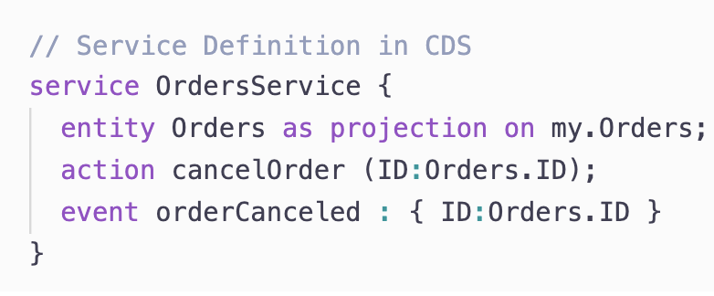
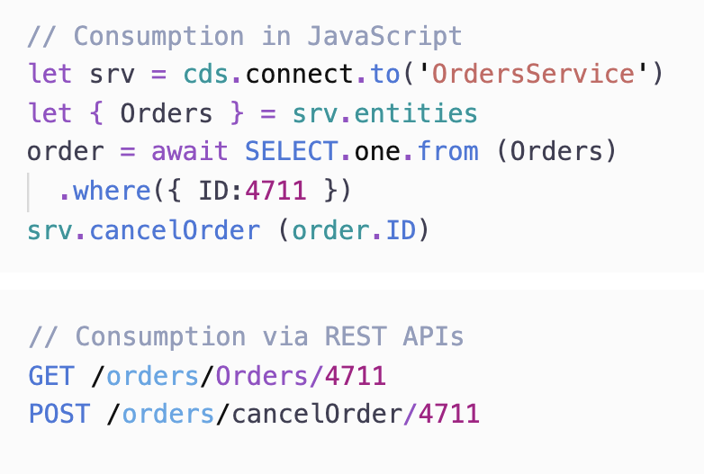
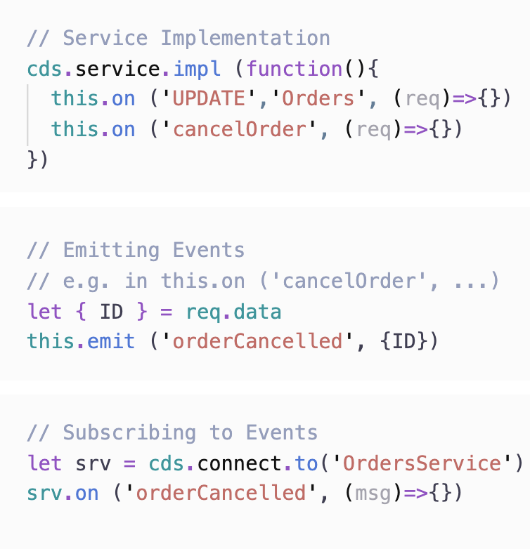

# 1. 소개

엔터프라이즈급 애플리케이션 개발을 위한 프레임웍


가장 중요한 요소는 CDS로 모델링과 서비스 정의 언어이다. Entity와 서비스 Controller의 역할이라고 보면 된다.

## CDS를 이용하여 도메인설계에 집중.


위 그림에서 보면 맨 좌측의 역할을 CDS가 담당한다. Java개발로 보면 Entity, Controller/Service뿐만 아니라 UI를 위한 기본 마크업까지도 담당한다. 
맨 좌측은 Event Handlers는 Service영역에서 확장이 필요할 때 java나 nodejs로 해당 부분을 custom하게 개발하여 코드를 넣을 수 있다.

### Core Data Services(CDS)

CDS는 이해하기 쉬운 방식으로 추상화시킨 범용 모델 언어로 CAP의 근간이 된다.

#### 도메인 모델로 사용되는 CDS


CDS는 기존에 엔터티생성과 관계연결의 역할을 수행한다. 또한 Annotation을 이용하여 Validation이나 권한체크기능도 수행할 수 있다 Spring JPA의 Entity객체에 사용되는 Annotaion과 같은 역할이라고 볼수 있다.
또한 Composition기능으로 모델을 구조화할 수 있는데, JPA로 보면 1:N 관계를 연결하는 것과 유사하다.

#### CDS Aspects & Mixins


Aspects는 디자인할때나 Runtime시에 동적으로 모델을 확장할 수 있도록 한다.

### Dynamic Querying & Views

CAP의 모든 데이터 액세스는 동적 쿼리를 통해 이루어지며,이를 통해 클라이언트는 실제로 필요한 정확한 정보를 요청할 수 있습니다. 이러한 강력한 고유 쿼리 기능은 동적 확장 성뿐만 아니라 자동으로 요청을 처리하는 데 중요한 역할을합니다

#### Core Query Language (CQL)

CQL은 CDS의 고급 쿼리 언어로 개체 그래프 및 엔티티 구조를 쉽게 쿼리할 수 있다. JPA의 관계에 의한 개체 그래프와 유사하다.

```SQL
SELECT ID, addresses.country.name from Employees
```

```SQL
SELECT Employees.ID, Countries.name FROM Employees
 LEFT JOIN Addresses ON Addresses.emp_ID=Employees.ID
 LEFT JOIN Countries AS Countries ON Addresses.country_ID = Countries.ID 
```

첫번째는 CQL로 두번째는 일반 SQL문으로 작성한 것으로 동일한 결과이다. CQL을 위햐서는 Composition이되어 있어야 한다.

#### Queries as first-order Objecs(CQN)


쿼리를 Object처럼 전달하고 Return받은 수 있는 1차 객체로 고려하여 처리한다. 

#### Projections at Design Time


CDS안에서 CQL을 사용하여 기본 도메인 모델에 Select절을 선택적으로 사용하는 View를 선언하여 사용할 수 있다.

### Services & Events

CAP에서의 모든 Action은 아래의 원칙으로 서비스와 이벤트기반이다.

1. 모든 액선은 서비스이다.
1. 서비스는 CDS안에 선언된다.
1. 서비스는 uniform API를 제공한다.
1. 서비스는 이벤트에 반응한다.
1. 서비스는 다른 서비스를 사용한다.
1. 모든 Data는 Passive하다. 자체적인 활동이 없이 REST에 의해서 사용된다.?

#### CDS안에서 서비스 정의





서비스는 CDS모델 안에 선언이 된다. 외부로 노출하는 엔티티, 액션, Event를 CDS안에 선언한다.

실제 구현은 Java나 Node.js에서 구현한다.

#### 서비스 사용



정의된 서비스는 코드나 REST API를 이용하여 사용할 수 있다. 


#### 이번트 발생



선언된 action이 호출이 되면 비동기적으로 이벤트가 발생은 한다. 서비스 핸들러를 Java에서 구현하여 custom한 로직을 추가할 수 있다. 또한 다른 서비스에서 생성한 이벤트를 구독하여 사용할 수 있다.

### 미리 선언된 서비스

CAP은 일반적인 기본 구현을 미리 제공하고 있다. Spring Data JPA에 JpaRepository와 유사한 기능이다.

#### 자동추가되는 서비스

* CRUD Request
    * Default Data Source가 설정이 되어 있고, 노출된 엔티티가 uinon 이나 join을 사용하지 않았을 때
* Deeply-Nested Documensts
    * 엔티티의 연관관계가 맺어져 있는 엔티티에 대해서도 기본 CRUD를 제공한다. 
    * Parenet/Child 관계가 있는 Data를 Insert할때 한번에 처리할 수 있을 것 같음.
* Media Data
    * 엔티티 요소에 Annotaion을 이용하여 Media Data를 포함할 수 있다.
* Draft Choreography
    * ???

#### 반복작업

* Implicit Pagination
* Input Validation
* Authentication
* Authorization
* Localization / i18n
* Concurrency Control

#### BP 사례적용
* Common Reuse Types & Aspects
* Managed Data
* Localized Data
* Temporal Data
* Verticalization & Extensibility
